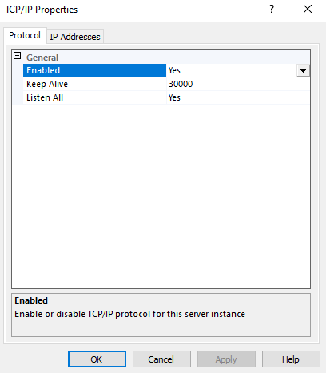
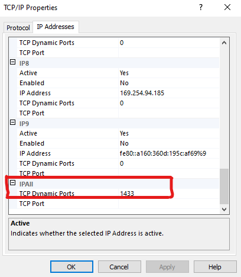
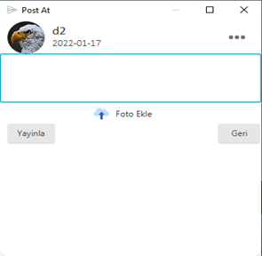

# Sosyal-Medya
A simple facebook-like social media project that has simple functions such as  adding/deleting friends, text/photo sharing and messaging. Under the hood, it has an MVC arcitecture pattern and uses JavaFX and MSQL Server.

Table of contents
-----------------

* [Introduction](#introduction)
* [Installation](#installation)
* [Usage](#usage)
* [Known issues and limitations](#known-issues-and-limitations)
* [License](#license)
* [Authors and history](#authors-and-history)
* [Acknowledgments](#acknowledgments)

Introduction
------------

Installation
------------
### There are two main steps to launch this project :

**1. You need to download and configure MSQL Server, as it is the database service used by the application.**

**2. Import and create the 'Sosyal Medya' database from the [script](Database) provided in the Database folder.**

If you already have MSQL Server just make sure your TCP Dynamic Port is set 1433 and skip to the [last part](#last) directly.

The second step is relatively easy, however, the first step may be a little long if it is your first time. Without further ado, let's start.

### Downloading and configuring MSQL Server :

  
 Click to Expand 

1. From microsoft [website](https://www.microsoft.com/en-us/sql-server/sql-server-downloads) download and install _SQL Server Express_.

2.  After installing it, download [_SQL Server Management Studio (SSMS)_](https://docs.microsoft.com/en-us/sql/ssms/download-sql-server-management-studio-ssms?view=sql-server-ver15) (The IDE we will be using to configure the server and write our sql) :

  

3. The first thing to do after openning _SQL Server Manager_ is to change the defualt option and enable logging in through a username and a password.\
To do this, left click on the server name and click on properties. After that click on security, and you should be here :

  

By defualt, it is set _Windows Authentication Mode_, change it to the one below and close the window.

4. The next step is to create a user name and a password to use by our application. Under _Security_, left click on _Logins_ and select _New Login_ :

  

Here, just enter you login (user) name and under _SQL Server Authentication_ enter a password. **Just make sure the options below are not enabled**.

  

_Note : sometimes you may receive an error while trying to alter the database due to not having permission. To fix this, expand the Logins part and look for the new login you created, and click on properties. Then find Server Roles and be sure you have the sysadmin role_

  

5. Now, leave the SSMS on the side. Search for _SQL Server Configuration Manager_ on your computer and open it (it should have been automaticly installed when you did step number 1). 

6. Under _Network Configuration_, set the _TCP/IP_ option to enabled :

  

_Note : It may tell you need to restart the server, you can either restart your pc or just restart the server service from the configuration manager directly._

  

7. After that double click on it and make sure the Enabled option is set to YES.

  

8. Then on the same window press _IP Addresses_ tab. Find the _IPAll_ option and set the port number to **1433**.

  

 

 
### <a name = "last" > Import and create the 'Sosyal Medya' database : </a>

1. And lastly, import and create the 'Sosyal Medya' database from the [script](Database) provided in the Database folder. You can either execute the script directly or copy it then execute it.

2.  At long last we are finished with setting up the server!!! Now you just need to change the login username and password in the [Start](Sosyal%20Medya/src/main/Start.java) java file to match the login you created :

  

 
 
 

One last thing you must have already done if you are using JavaFX. Add VM Arguments to the project, as specified in the picture below (eclipse) :

  

> --module-path "C:\Program Files\Java\javafx-sdk-17.0.1\lib" --add-modules javafx.graphics,javafx.base,javafx.controls,javafx.fxml,javafx.web

At this point you should have no problem running the project.

Usage
-----

### Basic operation

The program offers various features to try:

1. **Adding an account :**

2. **Posting :**
When you click on 'What are your thoughts today' box in the timeline, a window that you can write a text into and add an image appears :

 

  

3. **Adding/Deleting friends :**

4. **Resetting password :**

Known issues and limitations
----------------------------
**You can not comment:**

License
-------

This program is distributed under the terms of the [MIT License (MIT)](https://creativecommons.org/licenses/by/4.0/).  The license applies to this file and other files in the [GitHub repository](https://github.com/esammahdi/Processing/edit/main/Terrain%20Generator/) hosting this file.

Authors and history
---------------------------

* Esam Bashir : The original author.

Acknowledgments
---------------

Working with JavaFX to make a complete project like this has been very stressing, especially considering the amount of things -that are mostly provided in most other modern frameworks (the ones I saw at least)- you have to build from scratch with basic elements.
Also, JavaFX  looks are outdated and it was very hard to implement modern designs that may have taken just few lines in other frameworks.

### As mentioned, working with JavaFX has been hard, and I would like to thank some people whose works were very important in completing this project : 

**TimeLine and Post UIs** :

The main page UI is the largely the same as [Mahmoud Hamwi](https://www.youtube.com/channel/UCcAThteKmBlwCKsKlJhOQfA)'s [JavFX UI: Facebook Design with Dynamic VBbox items](https://www.youtube.com/watch?v=_1nqY-DKP9A) video.

**Chat Box UI** :

The messaging box UI has largely been taken from 's [JavaFX and Java Sockets - Client Server Messenger](https://www.youtube.com/watch?v=_1nqY-DKP9A) video.

**CSS :**

[Nonameplum](https://github.com/nonameplum)'s  css was used to give the buttons a modern look.\

_There was also another source that I used to make the side scrollers look modern_\
_The Ripple Animation was also taken from another site that I do not remember at the moment_

**Icons** : 

Most of the icons in the project were from [icons8.com windows app](https://www.microsoft.com/store/productId/9NK8T1KSHFFR). You should give it a try.

